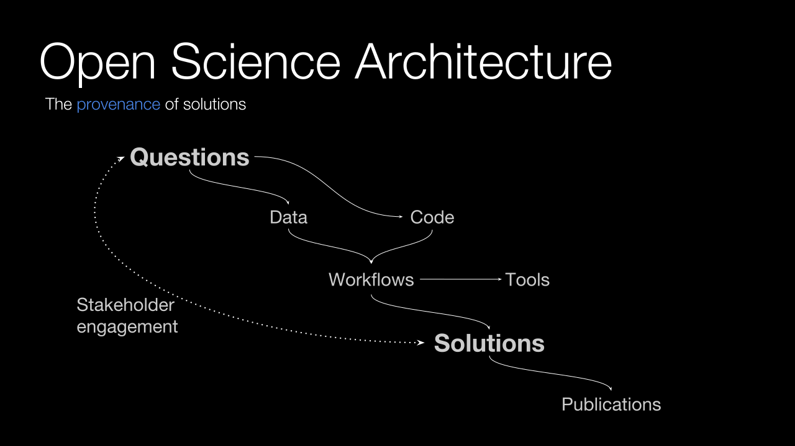

# 开始前的准备

本文主要参考了前面README.md文件中推荐的：[Intro to earth data science textbook](https://www.earthdatascience.org/courses/intro-to-earth-data-science)，记录开始python编程前的准备工作。

个人学习python的原因可以归纳为以下几点：

- 人工智能算法最常用语言
- 常用基本科学计算，数据分析，GIS，地球科学等水文水资源相关学科计算库丰富
- 上手快等

主要目的是为了快速实现科学计算。关于 Open Reproducible Science 可以参考[What Is Open Reproducible Science](https://www.earthdatascience.org/courses/intro-to-earth-data-science/open-reproducible-science/get-started-open-reproducible-science/)，这里贴个图。



说明：本项目大部分内容是在windows 10下jupyter lab（稍后介绍）下完成的，有一部分提到的内容是在Ubuntu18.04下实践的，会有专门说明。另外，windows下推荐使用windows终端：https://www.zhihu.com/question/323284458 ，所以开始之前最好先在windows下安装好“终端”。

在开始python之前先了解一些常见工具的配置和基本使用方法，包括：

- git and github
- jupyter notebook/lab

这些内容参考了：[Setup Your Earth Analytics Python, Git, Bash Environment On Your Computer](https://www.earthdatascience.org/workshops/setup-earth-analytics-python/)

如果需要补充一点计算机常识，以有助于编程快速学习，可以参考b站视频 crash course：[【计算机科学速成课】[40集全/精校] - Crash Course Computer Science](https://www.bilibili.com/video/av21376839)

## git 和 github

Git 是版本控制的工具，简单地说，通过它能完成对不同开发者不同时间写的代码文件（即不同版本）的高效控制与管理，类似于我们日常管理不同时间更新的word不同版本文件，只不过我们一般都是复制粘贴一个新文件，然后命名后面加上日期，以此区分，而git可以自动地帮助记录下不同版本，并随意获取查看不同版本的文件内容，当然git还有很多更强大的功能，使用中可逐渐体会。

Ubuntu或者win10下的Ubuntu里已经安装了git，不必再装了；win10下需要自行下载并安装：官网下载，安装一路默认即可。

Github 是代码共享的网站，每个人可以将自己本地电脑由git控制的代码库（repository，以下简称repo）上传到github上与他人分享，并协作开发。也就是说，github就类似于一个云端的代码库，本地的代码和它上面的代码可以保持同步的关系。使用github前，每个人需要注册一个自己的账号：直接百度搜索github，进入github官网，找到“sign up”标识，进行注册即可，注册后登陆就能进入自己的帐户。github服务器不在国内，所以防火墙对它稍微有一些影响，直接访问常看不到图片，有时候下载repo也不是特别方便，甚至无法访问，所以还是推荐科学上网，可以参考[这里](https://github.com/OuyangWenyu/elks/blob/master/common-sense/else/vpn.md)选择一些工具。

git和github之间关系：我们写代码或者文档更多地肯定还是在自己本地的电脑上操作，所以我们本地的repo版本需要本地的git软件来管理；github是一个云端代码库，我们可以利用本地的git工具将我们的本地repo上传到github上，这样别人就可以看到我们的repo（各个版本都能看到）；当然我们也能在github上下载别人的代码来使用，还可以修改别人的代码来实现协作。

关于github的使用，推荐去这里看看：https://www.zhihu.com/question/20070065/answer/79557687

本地git的使用依靠git bash命令。关于bash是什么，可以参考：[How to Access and Use Shell to Set Up a Working Directory](https://www.earthdatascience.org/workshops/setup-earth-analytics-python/introduction-to-bash-shell/)，里面讲的还是很清楚的。git bash 里面敲命令和Ubuntu系统下的指令一样的，比如cd，mkdir等常见命令。更多相关具体操作可以参考：https://www.runoob.com/git/git-basic-operations.html

其他参考资料：[Introduction to Git and GitHub for Python Developers](https://realpython.com/python-git-github-intro/)

最后记录一些常用操作，根据实际使用情况慢慢补充：

### 配置用户信息

第一次使用git，通常需要配置用户名和邮箱信息：

```Shell
git config --global user.name “Your Name”
git config --global user.email Youremail@example.com
```

### clone项目

进入到自己想要下载的repo页面后，点击绿色的“Code”，然后把地址copy下来，接着使用 “git clone <刚刚copy的地址>”命令，就能把代码下载到本地了；

第一个使用的git和github命令一定就是 git clone 了，以本项目为例，打开terminal，进入你想放置本项目的文件夹，执行：

```Shell
git clone https://github.com/OuyangWenyu/hydrus.git
```

### 通过SSH链接Github

上面是通过https来连接，这里补充下ssh方式，这种方式第一次配置相对麻烦一点，但是后续使用更加方便。

首先，使用如下命令创建密钥文件

```Shell
ssh-keygen -t rsa -C 你的github账号邮箱
```

输入后会提示保存key的文件以及passphrase，选择直接回车（一共三次），保存到默认位置，默认设置即可。

然后命令行上会显示处出密钥保存路径，其中私钥文件是 id_rsa，公钥文件是 id_rsa.pub

然后需要将SSH公钥添加到自己的GitHub账户。

- 复制id_rsa.pub文件中的全部内容
- 登陆到GitHub上，右上角小头像->Setting->SSH and GPG keys中，点击new SSH key，将复制的所有内容添加到其中；名称可以随便起

接下来测试链接：

```Shell
ssh -T git@github.com
```

将会看到如下提示：

The authenticity of host 'github.com (xxx.xxx.xxx.xxx)' can't be established.
RSA key fingerprint is xxxxxxxxxxxxxxxxxxxxxxxxxxxxxxxxxxxxxxx
Are you sure you want to continue connecting (yes/no)? 

输入yes，然后回车即可，这时候结果为 “ …You’ve successfully authenticated, but GitHub does not provide shell access”，则说明成功。

ssh下下载的方式和https下一样，在github中clone时选择SSH协议即可，比如下载本repo：

```Shell
git clone git@github.com:OuyangWenyu/hydrus.git
```

### 变化远程仓库地址

有时候 https连接不稳定, 想要切换 ssh, 参考[这里](https://docs.github.com/cn/github/getting-started-with-github/managing-remote-repositories#switching-remote-urls-from-https-to-ssh), 可以这么做:

```Shell
git remote set-url origin git@github.com:USERNAME/REPOSITORY.git
```

使用下面语句可以查看远程仓库是否已变:

```Shell
git remote -v
```

### add/commit/push

本地git常用的命令就是add/commit/push 三连了

``` Shell
# 修改文件后执行
git add -A
git commit -m "本次提交想要说明的东西"
git push
```

### 创建分支并推送到远程分支

参考了[git创建分支并推送到远程分支](https://blog.csdn.net/ljj_9/article/details/79386306)。

首先在master分支上，保证工作目标是干净的，也没有需要commit的：

``` Shell
git branch
git status
```

然后新建一个本地分支：

```Shell
git checkout -b  <你的分支名称>
```

比如常见的新建一个“开发”分支：

```Shell
git checkout -b dev
```

然后把新建的本地分支push到远程服务器，远程分支与本地分支同名（当然可以随意起名）：

```Shell
git push origin <你的分支名称>:<你的分支名称>
```

使用git branch -a查看所有分支，会看到remotes/origin/<你的分支名称> 这个远程分支，说明新建远程分支成功。

切换分支使用如下命令即可：

```Shell
git checkout  <你的分支名称>
```

### 拉取远程分支

参考：https://blog.csdn.net/tterminator/article/details/52225720

```Shell
# 查看所有远程分支
git branch -r
```

第一种方式：

```Shell
git checkout -b 本地分支名x origin/远程分支名x
```

使用该方式会在本地新建分支x，并自动切换到该本地分支x。

采用此种方法建立的本地分支会和远程分支建立映射关系。

方式二：

```Shell
git fetch origin 远程分支名x:本地分支名x
```

使用该方式会在本地新建分支x，但是不会自动切换到该本地分支x，需要手动checkout。

采用此种方法建立的本地分支不会和远程分支建立映射关系。

### 标签tag

使用如下命令可以查看已有标签：

```Shell
git tag
```

想要给当前已提交的版本打标签可以使用如下方式：

```Shell
git tag -a v1.4 -m "my version 1.4"
```

将刚刚创建的tag提交到github：

```Shell
git push origin v1.4
```

这样就会在github上看到tag小栏里出现新的tag了。

如果标签打错了，想要删除，执行下面语句即可：

```Shell
git tag -d v1.4 
```

想要把远程github上的对应标签也删除，执行下面语句：

```Shell
git push origin :refs/tags/v1.4 
```

### fork后同步源的新更新内容

fork了别人的repo，一段时间后，别人更新了，想要同步过来最新的内容，应该怎么做？

参考：

- [gitlab或github下fork后如何同步源的新更新内容？](https://www.zhihu.com/question/28676261)
- [Configuring a remote for a fork](https://docs.github.com/en/github/collaborating-with-issues-and-pull-requests/configuring-a-remote-for-a-fork)
- [Syncing a fork](https://docs.github.com/en/github/collaborating-with-issues-and-pull-requests/syncing-a-fork)

首先，给fork配置远程库

查看远程状态:

```Shell
git remote -v
```

确定一个将被同步给 fork 远程的上游仓库:

```Shell
git remote add upstream https://github.com/ORIGINAL_OWNER/ORIGINAL_REPOSITORY.git
```

然后再次查看远程状态，已经可以看到upstream的信息了。

从上游仓库 fetch 分支：

```Shell
git fetch upstream
```

转换到main分支

```Shell
git checkout main
```

合并远程分支：

```Shell
git merge upstream/main
# 或者
git rebase upstream/main
```

如果本地没有更改，那git就直接自动执行一个fast-forward，如果有更改，就手动调整一下有冲突的地方，然后commit即可。

最后push到自己的origin上即可。

```Shell
git push
```

### 查看历史版本

使用命令：

```Shell
git log
```

可以查看历史提交记录。

使用

```Shell
git checkout xxx（某个历史版本的哈希值，即git log下显示的每次commit对应的一串数字字母）
```

即可回到xxx的那个版本。

## jupyter notebook/lab

本节内容主要来自一篇[Jupyter Notebooks的指南](https://www.analyticsvidhya.com/blog/2018/05/starters-guide-jupyter-notebook/)。

### 引言

如果说有什么数据科学相关领域的工作人员都应该使用或必须了解的工具，那非 Jupyter Notebooks 莫属了（之前也被称为 iPython 笔记本）。Jupyter Notebooks 很强大，功能多，可共享，并且提供了在同一环境中执行数据可视化的功能。

Jupyter Notebooks 允许大家创建和共享文档，从代码到全面的报告都可以。它们能帮助简化工作流程，实现更高的生产力和更便捷的协作。

jupyter lab 可以认为是notebook的升级版，使用更方便，所以直接使用它即可。

### 安装

jupyter lab 不需要单独安装，直接安装anaconda之后就可使用它。安装anacodna时，注意和自己的操作系统匹配，如果是linux注意distro发行版也要匹配。另外2020年，python2就不更新了，所以能用python3还是用python3。

windows下安装anaconda就直接一路默认即可，安装完毕之后记得配置环境变量，这里给出一个个人安装windows64位 anaconda python3.7版本时的环境配置：

```Text
xx\anaconda3
xx\anaconda3\Library\mingw-w64\bin
xx\anaconda3\Library\bin
xx\anaconda3\Scripts\bin
```

另外，这里记录一个个人曾碰到的问题：使用pip安装时遇到了 “Can't install any package via `pip` on windows 10, ssl module in Python is not available” 的情况，这时候可以先配置好自己的环境变量，方式来自：https://github.com/pypa/virtualenv/issues/1139#issuecomment-453865723 ，shriprem commented on Jan 13, 2019的回答。

linux下可以使用如下代码安装：

```Shell
$ cd /home/wvo5024
$ curl -O https://repo.anaconda.com/archive/Anaconda3-2019.10-Linux-x86_64.sh
$ bash  Anaconda3-2019.10-Linux-x86_64.sh
Anaconda3 will now be installed into this location:
/home/wvo5024/anaconda3
...
installation finished.
Do you wish the installer to prepend the Anaconda3 install location
to PATH in your /home/wvo5024 /.bashrc ? [yes|no] yes
$ source ~/.bashrc
$ python  --version
```

以上 /home/wvo5024 表示的是我个人的文件夹名称。

### 开始使用

进入jupyter lab的方式很简单，进入项目所在文件夹，打开cmd，激活安装jupyter lab的python环境，然后输入：

```Shell
jupyter lab
```

即可。

jupyter lab中有几种cell类型：

- Code——写代码的地方。
- Markdown——写文本的地方。可以在运行一段代码后添加结论、注释等。
- Raw——这是一个可将笔记本转换成另一种格式（比如 HTML）的命令行工具。

平常主要使用Code 和 Markdown

还可以在Jupyter Notebooks中使用R、Julia和Javascript等其他语言。比如：[Interactive Workflows for C++ with Jupyter](https://blog.jupyter.org/interactive-workflows-for-c-with-jupyter-fe9b54227d92)。如果不感兴趣，下面内容可忽略，environments.yml文件中也不涉及下面的包，如果需要需自行安装。

- 要在 Jupyter 中启用 R，需要 IRKernel。直接使用conda安装即可:conda install -c r r-essentials ；R语言最常见的编辑器是RStudio，也可以使用 VSCode等。
- Julia，如果你是一位 Julia 用户，你也能在 Jupyter Notebooks 中使用 Julia！你可以查看这篇为 Julia 用户学习数据科学而编写的全面介绍文章，其中有一个章节就是关于如何在 Jupyter 环境中使用 Julia：https://www.analyticsvidhya.com/blog/2017/10/comprehensive-tutorial-learn-data-science-julia-from-scratch/ ；jupyterlab的julia插件安装方式可以参考[How to Add Julia to Jupyter Notebook](https://datatofish.com/add-julia-to-jupyter/)，Julia本身也有类似jupyter的Pluto工具可用；
- JavaScript， IJavascript kernel。这个 GitHub 库包含了在不同操作系统上安装这个 kernel 的各个步骤：https://github.com/n-riesco/ijavascript。注意，在使用它之前，你必需要先安装好 Node.js 和 npm。

接下来进入下一节：[1-basic-envir/2-python-envir.md](https://github.com/OuyangWenyu/hydrus/blob/master/1-basic-envir/2-python-envir.md)
