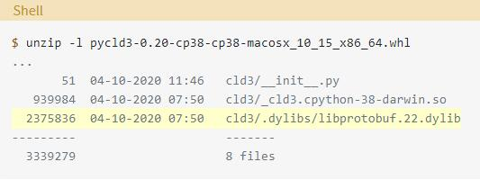

# 写一个别人方便用的python工具需要的配置

之前要使用别人的python包时，使用conda或者pip就能轻松的安装好，不需要从源码开始，很方便。然后写自己的python包时直接调用它们就行了，对于自己构建的python模块，也是直接调用就行。但是，如果你想要让自己的程序让程序之外整个系统上都能随意使用时，当你想让别人也能轻松地使用你的module时，这就不足够了。前者通常要求我们向module增加一个setup.py文件，后者则需要我们将程序打包发送到PyPI（这样别人就能pip安装了）。

下面具体内容主要参考了：

- [What Are Python Wheels and Why Should You Care?](https://realpython.com/python-wheels/)
- [How to Publish an Open-Source Python Package to PyPI](https://realpython.com/pypi-publish-python-package/#using-the-real-python-reader)
- [the-hitchhikers-guide-to-packaging](https://the-hitchhikers-guide-to-packaging.readthedocs.io/en/latest/quickstart.html)
- [Writing a Python Package](https://towardsdatascience.com/writing-a-python-package-561146e53351)

## Wheels

先了解下 Python .whl 文件，或称 wheels 轮子。它是 Python 中很少被讨论的部分，但它们对 Python 软件包的安装过程是很重要的。如果你用 pip 安装了一个 Python 包，那么很可能它已经使安装过程变得更快、更有效率。

轮子是Python生态系统的一个组成部分，有助于使包的安装工作正常进行。它们允许在软件包分发过程中实现更快的安装和更多的稳定性。

要了解的内容有：

- 什么是轮子，它们与源码发行版相比如何？
- 如何使用轮子来控制软件包的安装过程
- 如何为你自己的Python软件包创建和发布轮子

构建轮子需要的最基本工具是：pip、wheel和setuptools，可以在本文件夹下打开命令行尝试下以下代码

```Shell
python -m venv env
.\env\Scripts\activate
python -m pip install -U pip wheel setuptools
```

在你学习如何将一个项目打包成轮子之前，了解一下从用户方面使用轮子的情况是有帮助的。学习轮子如何工作的一个好方法是，从安装不是轮子的东西开始。

比如有时候用pip安装 包，pip检索到的tar.gz压缩包就是一个源码发行包，或称sdist，而不是一个轮子。

一个源码包包含源代码。这不仅包括 Python 代码，还包括与软件包捆绑的任何扩展模块 (通常是 C 或 C++) 的源代码。在源码发行版中，扩展模块是在用户端而不是在开发者端进行编译的。

源码发行版也包含一捆元数据，放在一个叫做<包名>.egg-info的目录中。这些元数据有助于构建和安装软件包，但用户并不真正需要对其做任何事情。

从开发者的角度来看，当你运行下面的命令时，一个源码发行就是被创建的东西。

```Shell
python setup.py sdist
```

有的包就会直接从PyPI上下载 .whl 文件，比如numpy，当Pip在PyPI上找到一个兼容的轮子时，就不存在构建阶段。

从开发者的角度来看，轮子是运行以下命令的结果。

```Shell
python setup.py bdist_wheel
```

为什么有的给你一个source distribution，而有的能提供一个wheel？你可以通过查看每个项目在PyPI上的页面并导航到下载文件区域来了解其中的原因。每个包都有自己的考虑，比如：

> uWSGI provides only a source distribution (uwsgi-2.0.18.tar.gz) for reasons related to the complexity of the project.

> chardet provides both a wheel and a source distribution, but pip will prefer the wheel if it’s compatible with your system. You’ll see how that compatibility is determined later on.

另一个用于轮子安装的兼容性检查的例子是psycopg2，它为Windows提供了一套广泛的轮子，但没有为Linux或macOS客户端提供任何轮子。这意味着 pip install psycopg2 可能会根据你的具体设置获取轮子或源码分布。

为了避免这些类型的兼容性问题，一些软件包提供了多个轮子，每个轮子都是针对特定的 Python 实现和底层操作系统的。

到目前为止，你已经看到了轮子和 sdist 之间的一些明显区别，但更重要的是这些区别对安装过程的影响。

### Wheels Make Things Go Fast

轮子使 Python 包的端到端安装更快，有两个原因。

1. 在其他条件相同的情况下，轮子的大小通常比源码发行版小，这意味着它们可以在网络上更快地传播
2. 直接从轮子上安装避免了从源发布版上构建软件包的中间步骤。

几乎可以保证轮子的安装时间是从源码安装所需时间的一小部分。

可以通过传递--no-binary选项，使pip忽略其对轮子的倾向性，直接从源码安装：

```Shell
python -m pip install \
      --no-cache-dir \
      --force-reinstall \
      --no-binary=:all: \
      cryptography
```

这条命令告诉 pip 使用cryptography源码发行版，即使有合适的轮子也仍如此。“--no-binary=:all:” 使该规则适用于 cryptography 和它的所有依赖项。

如果使用 --no-binary，你很可能会看到一个错误，说是缺少cryptography安装所需的头文件，这也是使用源码发行版令人沮丧的部分原因。如果是这样，cryptography 文档的安装部分会建议你在特定的操作系统中需要哪些库和头文件。

现在你可以重新安装cryptography，但这次要确保 pip 使用来自 PyPI 的轮子。因为完全没有参数时，pip会倾向于使用轮子，这类似于直接调用pip install。但这里，可以通过使用 --only-binary 来要求轮子，来明确这个意图

```Shell
python -m pip install \
      --no-cache-dir \
      --force-reinstall \
      --only-binary=cryptography \
      cryptography
```

### What Is a Python Wheel?

Python .whl 文件本质上是一个 ZIP (.zip) 归档文件，它有一个特别制作的文件名，告诉安装者轮子将支持哪些 Python 版本和平台。

轮子是一种内置的发行版。在这种情况下，内置的意思是轮子是以随时可以安装的格式出现的，并允许你跳过源代码发行版所需的构建阶段。

值得一提的是，尽管使用了构建这个术语，但轮子并不包含 .pyc 文件，或已编译的 Python 字节码。

一个轮子的文件名被分解成由连字符分隔的部分。

```Text
{dist}-{version}(-{build})?-{python}-{abi}-{platform}.whl
```

在{括号}中的每一节都是一个标签，或者说是轮子名称的一个组成部分，它带有一些关于轮子所包含的内容以及轮子将在哪里工作或将不工作的意义。

比如 cryptography 发布多个轮子。每个轮子都是一个平台上的，意味着它只支持Python版本、Python ABI、操作系统和机器架构的特定组合，例如 cryptography-2.9.2-cp35-abi3-macosx_10_9_x86_64.whl：

- cryptography 是软件包名称。
- 2.9.2是cryptography的软件包版本。版本是符合 PEP 440 的字符串，如 2.9.2, 3.4, 或 3.9.0.a3。
- cp35是Python标签，表示轮子所要求的Python实现和版本。cp 代表 CPython，即 Python 的参考实现，而 35 表示 Python 3.5。例如，这个轮子与Jython不兼容。
- abi3是ABI标签。ABI代表应用二进制接口。你其实不需要担心它的含义，但abi3是一个单独的版本，用于Python C API的二进制兼容。
- macosx_10_9_x86_64 是平台标签，它恰好是一个相当大的标签。在这种情况下，它可以被进一步分解为子部分。
    - macosx是macOS操作系统。
    - 10_9是用于编译Python的macOS开发者工具SDK版本，它反过来构建了这个轮子。
    - x86_64是指x86-64指令集架构。
    
最后一个组件.whl在技术上不是一个标签，而是标准的.whl文件扩展名。综合来看，上述组件表明了这个密码学轮子所设计的目标机器。

### Advantages of Python Wheels

轮子在很多方面对Python包的用户和维护者都有好处。

- 无论是纯 Python 包还是扩展模块，轮子的安装速度都比源码发行版快。
- 轮子比源码发行版要小。例如，6个轮子的大小大约是相应的源码发行版的1/3。当你考虑到一个单一软件包的pip安装实际上可能会启动下载一连串的依赖关系时，这种差异就变得更加重要。
- 轮子将setup.py的执行从方程中剔除。从源码发行版安装时，会运行该项目setup.py中的任何内容。正如PEP 427所指出的，这相当于任意代码执行。Wheels完全避免了这一点。
- 不需要编译器来安装包含已编译扩展模块的轮子。扩展模块包含在针对特定平台和Python版本的轮子中。
- pip在轮子中自动生成与正确的Python解释器相匹配的.pyc文件。
- 轮子通过减少安装软件包时涉及的许多变量来提供一致性。

你可以使用PyPI上一个项目的下载文件标签来查看不同的发行版。例如，pandas分发了大量的轮子。

## 构建自己的轮子

作为一个开发者，如果你打算向社区发布Python包，那么你应该非常关心为你的项目发布轮子，因为它们使终端用户的安装过程更简洁，更不复杂。

你能用兼容的轮子支持的目标平台越多，你在 GitHub 上看到的标题为 "在 XYZ 平台上安装失败 "的问题就越少。为你的 Python 软件包分发轮子，客观上降低了软件包的用户在安装时遇到问题的可能性。

你需要做的第一件事是安装轮子，以便在本地建立一个轮子。确保 setuptools 也是最新的也没什么坏处

```Shell
python -m pip install -U wheel setuptools
```

### Different Types of Wheels

正如本教程中所涉及的，轮子有几种不同的变化，轮子的类型反映在它的文件名中。

- 一个universal wheel通用轮子包含 py2.py3-none-any.whl。它同时支持任何操作系统和平台上的 Python 2 和 Python 3。在Python Wheels网站上列出的大多数轮子都是通用轮子。
- 一个pure-Python wheel 纯 Python 轮子包含 py3-none-any.whl 或 py2.none-any.whl。它支持 Python 3 或 Python 2，但不支持两者。其他方面与通用轮子相同，但它的标签是 py2 或 py3，而不是 py2.py3 标签。
- 一个 platform wheel 平台轮支持特定的 Python 版本和平台。它包含表示特定 Python 版本、ABI、操作系统或架构的片段。

轮子类型之间的差异是由它们支持的Python版本和它们是否针对特定的平台决定的。下面是对轮子变化之间差异的一个浓缩的总结


可以用相对较少的设置建立通用轮子和纯Python轮子，但平台轮子可能需要一些额外的步骤。

### Building a Pure-Python Wheel

你可以使用setuptools为任何项目建立一个纯Python轮子或一个通用轮子，只需一个命令。

```Shell
python setup.py sdist bdist_wheel
```

这将创建一个源代码发行版（sdist）和一个轮子（bdist_wheel）。默认情况下，两者都将被放在当前目录下的dist/中。为了亲眼看看，你可以为[HTTPie](https://github.com/jakubroztocil/httpie)（一个用Python编写的命令行HTTP客户端）建立一个轮子和sdist。

下面是为HTTPie软件包建立两种类型的发行版的结果

```sEHLL
git clone -q git@github.com:jakubroztocil/httpie.git
cd httpie
python setup.py -q sdist bdist_wheel
ls -1 dist/
```

克隆这个项目，移动到它的根目录，然后调用 python setup.py sdist bdist_wheel，就可以看到，dist/包含了一个轮子和一个源码发行版。

产生的发行版默认放在dist/，但你可以用-d/-dist-dir选项来改变它。

### Specifying a Universal Wheel

一个通用的轮子是一个纯 Python 项目的轮子，它同时支持 Python 2 和 3。有多种方法可以告诉 setuptools 和 distutils 一个轮子应该是通用的。

选项 1 是在你的项目的 setup.cfg 文件中指定这个选项。

```Config File
[bdist_wheel]
universal = 1
```

选项2是在命令行中传递名为--universal的标志。

```Shell
python setup.py bdist_wheel --universal
```

选项3是使用选项参数告诉setup()本身关于该标志的情况。

```Python
# setup.py
from setuptools import setup

setup(
    # ....
    options={"bdist_wheel": {"universal": True}}
    # ....
)
```

虽然这三个选项中的任何一个都应该可行，但前两个是最经常使用的。无论你选择哪个选项，所产生的轮子都是相等的。选择主要归结于开发者的偏好和哪种工作流程最适合你。

### Building a Platform Wheel (macOS and Windows)

这块略麻烦，等到具体实践的时候再细看就行了：https://realpython.com/python-wheels/#building-a-platform-wheel-macos-and-windows

### Bundling Shared Libraries

另一个挑战是为依赖外部共享库的软件包建立轮子。manylinux镜像包含了一套预先筛选的库，如libpthread.so.0和libc.so.6。但如果你依赖的是这个列表之外的东西，比如ATLAS或GFortran

在这种情况下，有几种解决方案来处理。

- auditwheel将外部库捆绑到一个已经构建好的轮子中。
- delocate在macOS上也是这样做的。

方便的是，auditwheel存在于manylinux Docker镜像中。使用auditwheel和delocate只需要一个命令。只要告诉他们轮子文件的情况，他们就会做剩下的事情。就像下面这样：

```Shell
auditwheel repair <path-to-wheel.whl>  # For manylinux
delocate-wheel <path-to-wheel.whl>  # For macOS
```

这将通过你的项目的setup.py检测所需的外部库，并将它们捆绑到轮子中，就像它们是项目的一部分一样。

一个利用 auditwheel 和 delocate 的项目的例子是 pycld3，它为 Compact Language Detector v3 (CLD3) 提供 Python 绑定。

pycld3 包依赖于 libprotobuf，这不是一个通常安装的库。如果你看一下 pycld3 macOS 轮子，那么你会看到 libprotobuf.22.dylib 包含在那里。这是一个动态链接的共享库，被捆绑在轮子里



轮子与libprotobuf预包装在一起。.dylib类似于Unix的.so文件或Windows的.dll文件。

auditwheel和delocate知道要包括libprotobuf，因为setup.py通过库的参数告诉它们要包括libprotobuf。

```Python
setup(
    # ...
    libraries=["protobuf"],
    # ...
)
```

这意味着 auditwheel 和 delocate 为用户省去了安装 protobuf 的麻烦，只要他们是从有匹配轮子的平台和 Python 组合中安装的。

如果你发布的软件包有这样的外部依赖，那么你可以通过使用 auditwheel 或 delocate 来帮你的用户省去自己安装依赖的额外步骤。

### Building Wheels in Continuous Integration

除了在你的本地机器上构建轮子之外，另一个办法是在你的项目的CI管道（后续文档介绍）中自动构建它们。

有无数的CI解决方案与主要的代码托管服务集成。其中包括 Azure DevOps、BitBucket Pipelines、Circle CI、GitLab、GitHub Actions、Jenkins 和 Travis CI 等等。

如果你正在开发一个纯Python包，有 bdist_wheel 步骤，几乎所有主要的CI服务都能让你通过在项目中的一个特殊YAML文件中定义步骤，以一种不费力的方式完成这一工作。

例如，你可以在[GitHub Actions](https://help.github.com/en/actions/language-and-framework-guides/using-python-with-github-actions)中使用以下的语法

```yaml
name: Python wheels
on:
  release:
    types:
      - created
jobs:
  wheels:
    runs-on: ubuntu-latest
    steps:
    - uses: actions/checkout@v2
    - name: Set up Python 3.x
      uses: actions/setup-python@v2
      with:
        python-version: '3.x'
    - name: Install dependencies
      run: python -m pip install --upgrade setuptools wheel
    - name: Build wheels
      run: python setup.py bdist_wheel
    - uses: actions/upload-artifact@v2
      with:
        name: dist
        path: dist
```

在这个配置文件中，使用以下步骤建立一个轮子。

- 在第8行，指定该作业应该在Ubuntu机器上运行。
- 在第 10 行，使用 checkout 动作来设置你的项目仓库。
- 在第14行，告诉CI运行器使用Python 3的最新稳定版本。
- 在第21行，要求产生的轮子以工件的形式出现，一旦工作完成，你可以从用户界面下载。

然而，如果有一个复杂的项目（也许是一个有C语言扩展或Cython代码的项目），并且你正在努力制作一个CI/CD管道来自动构建轮子，那么很可能会有额外的步骤涉及。可以通过实例来学习：

- [yarl](https://github.com/aio-libs/yarl)
- [msgpack](https://github.com/msgpack/msgpack-python)
- [markupsafe](https://github.com/pallets/markupsafe)
- [cryptography](https://github.com/pyca/cryptography)

许多项目都会滚动自己的CI配置。然而，已经出现了一些解决方案，用于减少配置文件中指定的代码量来构建轮子。可以直接在你的CI服务器上使用[cibuildwheel](https://github.com/joerick/cibuildwheel)工具来减少构建多个平台轮子所需的代码行数和配置。还有[multibuild](https://github.com/matthew-brett/multibuild)，它提供了一套shell脚本来协助在Travis CI和AppVeyor上构建轮子。

### Making Sure Your Wheels Spin Right

构建结构正确的轮子可能是一个微妙的操作。例如，如果你的Python包使用src布局，而你忘了在setup.py中正确指定，那么产生的轮子可能包含一个在错误位置的目录。

你可以在bdist_wheel之后使用的一个检查工具是check-wheel-contents。它可以寻找一些常见的问题，比如软件包目录的结构不正常或者存在重复的文件。

```Shell
check-wheel-contents dist/*.whl
```

在这种情况下，check-wheel-contents表示所有与ujson轮子有关的东西都检查完毕。如果不是，stdout将显示一个可能的问题摘要，就像flake8这样的linter一样。

另一种确认你所构建的轮子有正确内容的方法是使用TestPyPI。首先，你可以在那里上传软件包。

```Shell
python -m twine upload \
      --repository-url https://test.pypi.org/legacy/ \
      dist/*
```

然后，你可以下载相同的软件包进行测试，就像它是真的一样。

```Shell
python -m pip install \
      --index-url https://test.pypi.org/simple/ \
      <pkg-name>
```

这允许你通过上传然后下载你自己的项目来测试你的轮子。

### 将Python轮子上传到PyPI

现在是上传你的 Python 包的时候了。由于sdist和轮子都被默认放在dist/目录下，你可以使用twine工具上传它们，这是一个用于向PyPI发布软件包的工具。

```Shell
python -m pip install -U twine
python -m twine upload dist/*
```

由于sdist和bdist_wheel都默认输出到dist/，你可以安全地告诉twine使用shell通配符（dist/\*）上传dist/下的所有东西。

## 一个简单的例子（未完待续）

构建一个新项目的几个步骤：

### 1. Lay out your project

最小的 python 项目是两个文件。一个setup.py文件，描述关于你的项目的元数据，和一个包含Python代码的文件，实现你的项目的功能。

在这个例子中，我们将在项目(mypackage文件夹)中增加一些内容，以提供典型的最小项目布局。我们将创建一个完整的 Python 包，一个带有 __init__.py 文件的目录。这预示着未来的增长，因为我们项目的源代码可能会超过一个单一的模块文件。

我们还将创建一个README.txt文件，描述你的项目的概况，以及一个包含你的项目的许可证的LICENSE.txt文件。

这就够了，可以开始了。一个项目通常会有一些其他类型的文件，请参阅安排你的文件和目录结构，以了解一个更完整的项目的例子。

你的项目现在看起来就像这样：

```
mypackage
    LICENSE.txt
    README.md
    setup.py
    src/
        __init__.py
```

### 2. Describe your project

setup.py 文件是一个 Python 项目的核心。它描述了关于你的项目的所有元数据。有相当多的字段可以添加到项目中，使其具有描述项目的丰富元数据集。然而，只有三个必须的字段：名称、版本和包。如果你希望在Python Package Index (PyPI)上发布你的包，名称字段必须是唯一的。版本字段可以跟踪项目的不同版本。packages 字段描述了你在项目中放置 Python 源代码的位置。

我们的初始 setup.py 也将包括关于许可证的信息，并将重新使用 README.txt 文件中的 long_description 字段。

setup.py文件是pip会在给定文件夹中寻找的文件。它使用能用来执行打包的setuptools工具。它其中内容包括包的名称，包的简短描述以及作者的信息，还有python版本。

mypackage文件夹下有示例setup.py文件。

### 3. Create your first release

然后我们就可以尝试用用它，在本文件夹下打开terminal，执行：

```Shell
pip install .
```

此时输入：

```Shell
pip list
```

应该能看到有一个hello包。

在执行pip install . 语句的过程中，会创建一个wheel文件以用于发布包，然后使用wheel文件安装包到site-package文件夹中，如果要从网上下载其他包，则会在pkgs文件夹中创建缓存。

pip实际上就是一个从PyPI（Python Package Index）安装包的包安装器，是基于setuptools构建的。任何人都可以提交自己的包到PyPI上，全球的人都可以通过pip install your-package-name 来安装你上传的包。

从用户角度描述使用Distribution Utilities程序（“Distutils”）及其扩展在 Python 打包中的当前状态，描述如何通过构建包和安装第三方来扩展标准 Python 的功能：第三方包、模块和扩展。

Python 以其“batteries included”的理念而闻名，并拥有丰富的标准库。不过，作为一种流行语言，第三方包的数量远远大于标准库包的数量。因此，最终有必要了解如何在 Python 中使用、查找和创建包。

手动安装需要的额外软件包可能很乏味。因此，Python 有一个打包系统，允许人们以标准格式分发他们的程序和库，以便于安装和使用它们。除了分发包之外，Python 还为贡献包提供了一个中心服务。此服务称为 Python 包索引 (PyPI)。

一个package就是指一个拥有 \_\_init\_\_.py 文件的文件夹，比如本文件夹下执行：

```Shell
mkdir mypackage
cd mypackage
type nul > __init__.py
echo "# A Package" > __init__.py
cd ..
```

这会创建一个能被导入的包。

### 4. Register your package with the Python Package Index (PyPI)

### 5. Upload your release, then grab your towel and save the Universe!

