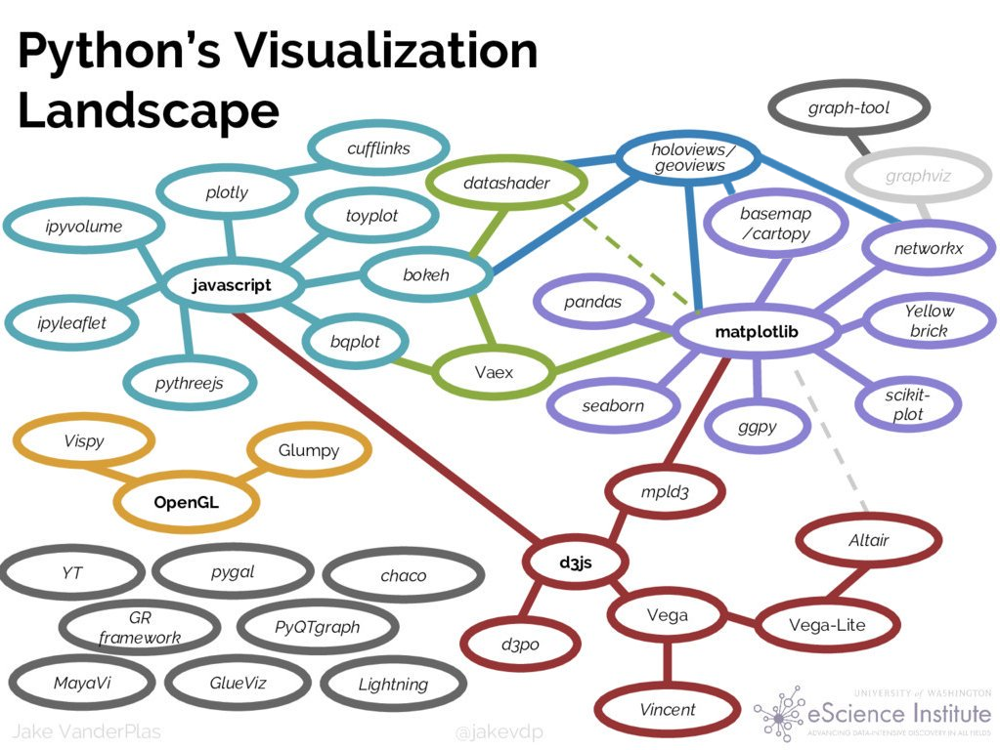
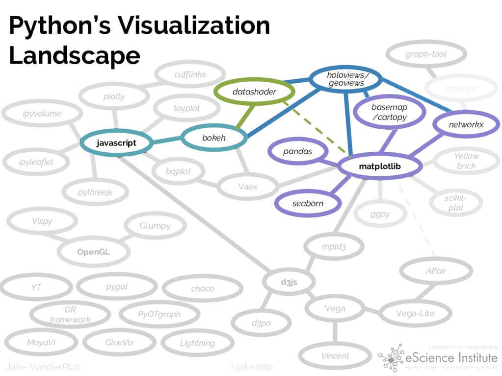

# python可视化

记录本文目的主要是了解python可视化的生态圈，以了解在什么条件下使用什么工具比较合适，本文主要参考了：[PyViz: Simplifying the Data Visualisation process in Python](https://towardsdatascience.com/pyviz-simplifying-the-data-visualisation-process-in-python-1b6d2cb728f1)

接触了python可视化的童鞋都会发现有太多的可视化包可以使用，都不知道怎么选择了，比如matplotlib这一最基本的库，拿来做简单图可以，但是复杂图还是用它就会比较麻烦。各个库都有自己的优缺点，在不同的特点上各有优势，而我们不可能一个个去学着怎么用，所以可以看看pyviz，它对python的可视化生态做了总结。

"PyViz is a coordinated effort to make data visualization in Python easier to use, learn and more powerful"

PyViz包含了一系列开源的python包，使得**在浏览器中**处理大小数据集都很容易。

pyviz包括了Holoviews, geoviews等诸多库，可以和pandas，geopandas等计算库兼容。

不过个人认为这个工具目前可能只是将各个工具箱整合起来，所以可能导致有些笨重，因此最好还是根据实际使用情况，独立安装较好。

根据github上的star情况：

- 对于一般的结果分析，数据统计可视化，个人认为结合使用matplotlib和seaborn即可
- 如果需要交互式分析数据，那么bokeh和plotly.py是较好的选择
- 如果涉及到gis数据可视化，如果需要交互式地那么使用plotly.py是比较好的选择，若只是结果分析，那么先尝试使用cartopy是较好的，此外geoplot之于caropy就像seaborn之于matplotlib，也是个可以尝试使用的库。

因此本repo的第三部分就按照上述结构组织，首先是matplotlib和seaborn的使用，然后是交互式的bokeh和plotly.py，以及gis可视化。和其他部分一样，都是边使用边记录，所以持续记录中。

关于可视化不错的一些资料：

- [The Python Graph Gallery](https://github.com/holtzy/The-Python-Graph-Gallery)