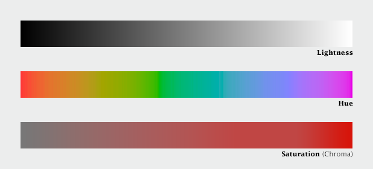
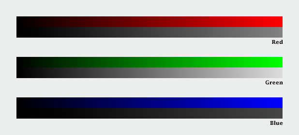

# Elegant Figures 简易翻译

该系列是一个Rob Simmon的系列blog，刊登在NASA earth observatory网站里。一共6篇，本文简单地意译下其主要内容。以便后面自己科研配图中使用。(不定时更新中...)

## Subtleties of Color 

这是系列的第一篇--颜色的微妙。

### Introduction

通常我们在选择颜色时都会打开一个调色板，然后选择一个灰度图或者一个彩虹色，点击apply，就给我们的图上了色。虽然我们知道颜色的选择并不是这么简单，但是我们通常都是这么做的。但是这导致许多可视化并不能很好地表达数据所揭示的内容。

数据可视化的目的是阐释数据，是为了展示隐藏在大量数字背后的数据模式和关系。

在空间数据集中，颜色可能是最有效的精确表达数量的方法，并且是已使用最广泛的。颜色的认真使用可以增强清晰度，帮助讲好故事，并吸引观看者进入到数据中。不好的颜色使用则会阻碍数据表达，甚至错误表达。

幸运地是，有效的，来表示数据的颜色使用的原则是直观的。并且已经由制图工作者发展了超过一个世纪。并由科研工作者进一步地认识，设计和可视化工作的改善了半个世纪。

虽然基础内容比较简单，但是仍有一些复杂的颜色选择，比如：

- 我们看到的光线和我们意识到的颜色之间的关系是十分复杂的
- 有许多不同类型的数据，每一种都适合不同的颜色框架
- 随意的颜色选择会让对数据集不熟悉的观众迷惑
- 暗场中的浅色与亮场中的深色在视觉上是不同的，这可能会使目标检测等一些可视化任务变得复杂

### (Very) Basic Color Theory

虽然肉眼观色是通过视网膜来检测RGB光线，但是我们却并不会以RGB方式思考颜色，而是以亮度（黑白），色度（红橙黄绿蓝靛紫）和饱和度（暗到亮）。这三个变量是基于人类认知的颜色系统的基石。印刷工和画家使用其他颜色系统来描述墨水和颜料的混合。

然而计算机却是以RGB的方式处理颜色的。并且不是人眼观测意义上的红绿蓝。计算机屏幕显示的颜色是一个很窄频率波段内的颜色的组合，而我们眼睛视网膜内的每个锥体是能检测到一个相对较宽的频谱的。更复杂的是计算机是线性计算光线的，而我们人类是对低光度比对高光度的变化更敏感的，且对绿色光比对红色光更敏感，对蓝光更不敏感。

比如上图三原色，我们是觉得绿色更亮的。因此，人类观察和计算机表达并不完全一致。

在我们的视觉中这些非线性的综合结果就是颜色感知是有些笨的。比如我们对一个颜色的饱和度范围的辨识能力是高度依赖于它的亮度的。换句话说，没有暗黄这种颜色的，即太暗了之后就辨别不出是黄色了。比如下图（最左边的hue小图和下方的lightness箭头以及中间图的saturation是三个坐标，该图片共三个图）。在亮度范围的中心附近，蓝色和红色渐变是可以非常饱和，但绿色色调不能（即我们观察绿色饱和度变化不明显）。此外，非常亮和非常暗的颜色总是不饱和的。

### CIE Color Spaces

颜色感知的不均匀性是由国际照明委员会上世纪30年代绘制的（国际照明委员会法语简称CIE）。CIE制定了一系列颜色空间来让科学家，艺术家和印刷师等来一致性地描述颜色，并能精准地在不同媒介之间转换。比如Adobe的Photoshop内部就使用CIE L\*a\*b来插值颜色梯度和转换RGB图（屏幕）为CMYK（打印）。

另一个标准CIE L\*C\*h \[lightness, chroma (saturation), hue\]是作者常用的颜色板。因为简单易用。它是基于人类视觉认知的。L\*C\*h下开发的颜色范围是能帮助我们准确表达数据的内涵的。

总之，人不是计算机。计算机颜色是线性和系统的，人的颜色感知是非线性不平衡的。许多工具是根据计算机设计的，而不是针对人的，包括以RGB或者HSV来指定或计算颜色的工具。恒定增强的亮度人看了是不会认为是线性的的，人对对红色、绿色和蓝色的响应也是不同的。找一些工具和调色板来描述感知色彩空间中的颜色，比如CIE L\*C\*h 或Munsell。

## The “Perfect” Palette
